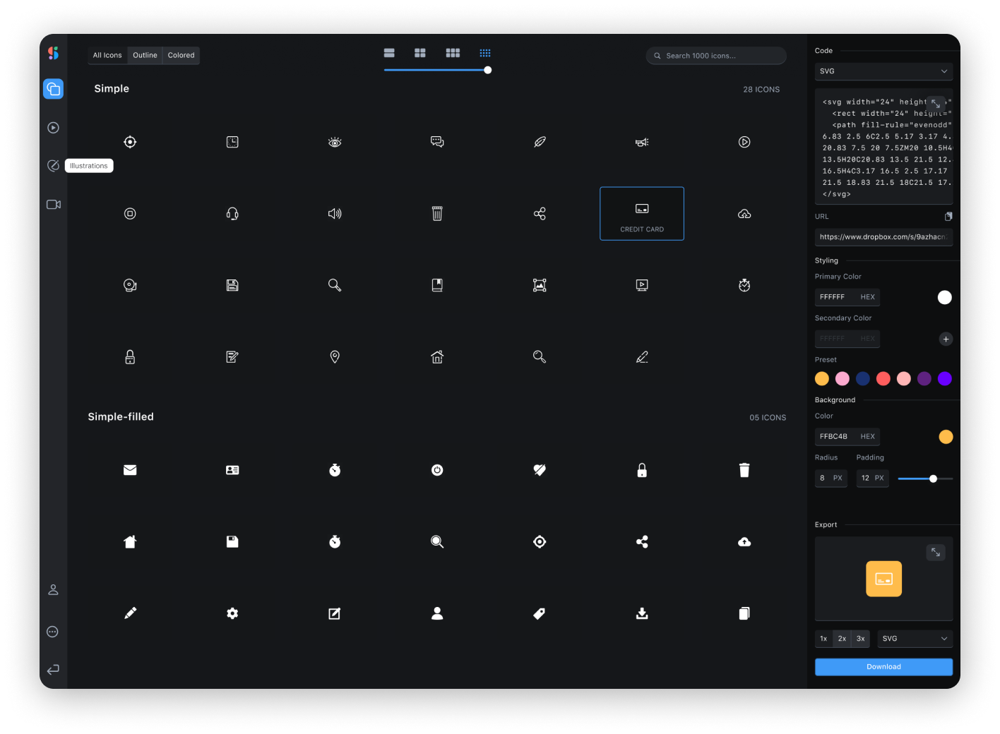

# Shape.so Library

1000+ Customizable, animated icons & illustrations. Shape lets you customize the style, colors and border of static & animated icons and illustrations.

For the full list of icons/illustrations, please head over to [Shape.so](https://shape.so/)

>

[](https://www.npmjs.com/package/shape-library) [](https://standardjs.com)



## Install

```bash
npm install --save shape-library
```

## Props

| Prop            |   Type   |   Default   | Description                                                                           |
| --------------- | :------: | :---------: | ------------------------------------------------------------------------------------- |
| type            | `string` |   `none`    | Specifies between rendering an icon or an illustration                                |
| category        | `string` | `undefined` | The type of icons/illustrations. Example: Color, Bold-Filled, Object, Elements        |
| name            | `string` | `undefined` | The name of the icons/illustrations. Example: lock, home, bookmark                    |
| primaryColor    | `string` |   `#000`    | Hex colors, rgba, and browser supported colors. The fill for the icons/illustrationss |
| secondaryColors | `string` |   `#000`    | Hex colors, rgba, and browser supported colors. The fill for the icons/illustrationss |
| backgroundColor | `string` |   `none`    | Hex colors, rgba, and browser supported colors                                        |
| theme           | `number` |     `0`     | Enter a number from 1-8 to specify each themes. See chart below for specific colors   |
| size            | `number` |     `0`     | Changes the width and height of the icon/illustrations                                |
| borderRadius    | `number` |     `0`     | Changes the rx on the <rect/> element                                                 |

## Theme Colors

| Theme Number | Hex Colors        |
| ------------ | ----------------- |
| 1            | `#FF5E5E,#1B5C6A` |
| 2            | `#FCAACF,#2249B3` |
| 3            | `#858585,#FED330` |
| 4            | `#193170,#2357DD` |
| 5            | `#F8B500,#5E227F` |
| 6            | `#FFB6B6,#139DB8` |
| 7            | `#FFD06F,#28323F` |
| 8            | `#07038C,#F20505` |

## How To Use - Icons

```jsx
import React from 'react';

import Shape from 'shape-library';

const App = () => {
  return (
    <Shape
      type='icons'
      category='color'
      name='lock'
      theme={1}
      size={100}
      backgroundColor='black'
      borderRadius={5}
    />
  );
};

export default App;
```

## How To Use - Illustrations

```jsx
import React from 'react';

import Shape from 'shape-library';

const App = () => {
  return (
    <Shape
      type='illustrations'
      category='abstract'
      name='bookmark'
      size={100}
      primaryColor='#051937'
      secondaryColor='rgba(168, 235, 18)'
    />
  );
};

export default App;
```

## License

MIT © [ThatGalNatalie](https://github.com/ThatGalNatalie)
